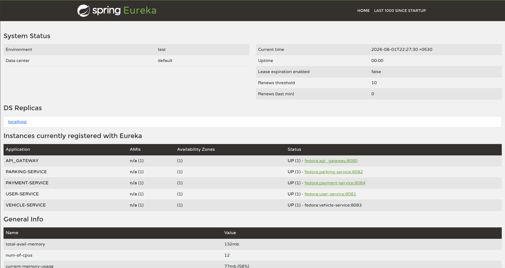

# Nexora — Smart Parking Management System (SPMS)

A cloud-native, microservice-based platform for real-time parking search, reservation, vehicle tracking, and payment processing. Built as the final examination assignment for **ITS 1018 — Software Architectures & Design Patterns II**, IJSE Graduate Diploma in Software Engineering.

## Architecture

Nexora is a polyglot microservices system: three Spring Boot services backed by MySQL, one Express/TypeScript service backed by MongoDB, all registered with a central service registry and exposed through a single API Gateway.

| Component | Tech | Port | Purpose |
|---|---|---|---|
| Eureka Server | Spring Cloud Netflix Eureka | `8761` | Service registry and discovery |
| Config Server | Spring Cloud Config (native profile) | `8888` | Centralized configuration for the 3 Java services |
| API Gateway | Spring Cloud Gateway (WebFlux) | `8080` | Single entry point, routes client traffic to all services |
| User Service | Spring Boot + MySQL (JPA) | `8081` | User registration, authentication, profile management |
| Parking Service | Spring Boot + MySQL (JPA) | `8082` | Parking space listing, reservation, availability tracking |
| Vehicle Service | Express + TypeScript + MongoDB | `8083` | Vehicle registration, ownership linking, entry/exit tracking |
| Payment Service | Spring Boot + MySQL (JPA) | `8084` | Mock payment processing, receipt generation, live validation against User/Parking/Vehicle |

**Inter-service communication:** Payment Service validates `userId`, `parkingId`, and `vehicleId` against the other three services in real time via a load-balanced `RestTemplate` resolved through Eureka — not just stored as unchecked foreign-key references.

**Routing:** the Gateway is the only entry point intended for external clients. Internal service-to-service calls (Payment → User/Parking/Vehicle) go directly through Eureka, bypassing the Gateway.

## Tech Stack

- **Java 21**, Spring Boot 4.1.0, Spring Cloud 2025.1.2
- **Spring Data JPA** + **MySQL** (3 separate databases: `user_db_nexora`, `parking_db`, `payment_db`)
- **Node.js**, Express, TypeScript, **MongoDB** (Mongoose) — Vehicle Service
- **Spring Cloud Netflix Eureka** — service discovery
- **Spring Cloud Gateway** (WebFlux) — API Gateway
- **Spring Cloud Config** (native/classpath profile) — centralized configuration
- **BCrypt** — password hashing (User Service)
- **Postman** — API testing

## Running the Project

Services must be started in this order, since several depend on infrastructure that must already be up:

```
1. eureka_server     (mvn spring-boot:run)
2. config_server      (mvn spring-boot:run)
3. user_service        (mvn spring-boot:run)
   parking_service      (mvn spring-boot:run)
   payment_service     (mvn spring-boot:run)
   -- any order among these three, but only after step 2 --
4. vehicle_service   (npm run dev)   -- independent, own .env config --
5. api_gateway         (mvn spring-boot:run)
```

Confirm all services are registered at the Eureka dashboard: `http://localhost:8761`

### Prerequisites
- Java 21, Maven
- Node.js + npm
- MySQL running locally (`user_db_nexora`, `parking_db`, `payment_db` — created automatically via `ddl-auto: update`, but the databases themselves must exist first)
- MongoDB running locally (`vehicle_service` database)
- Each Java service needs its own `application.yml` with local datasource credentials (not committed — see `application.yml.example` in each service)
- `vehicle_service` needs its own `.env` (not committed — see `.env.example`)

## API Access

All endpoints are accessible directly on each service's own port, or through the API Gateway on port `8080`:

| Direct | Via Gateway |
|---|---|
| `localhost:8081/user_service/...` | `localhost:8080/user_service/...` |
| `localhost:8082/parking_service/...` | `localhost:8080/parking_service/...` |
| `localhost:8083/api/v1/vehicles` | `localhost:8080/api/v1/vehicles` |
| `localhost:8084/payment_service/...` | `localhost:8080/payment_service/...` |

### Key Endpoints

**User Service** — `POST /register`, `POST /login`, `GET /{id}`, `GET /`, `PUT /{id}`, `DELETE /{id}`

**Parking Service** — `POST /`, `GET /{id}`, `GET /`, `GET /search?location=`, `POST /{id}/reserve`, `POST /{id}/release`, `PUT /{id}`, `DELETE /{id}`

**Vehicle Service** — `POST /`, `GET /{id}`, `GET /`, `GET /user/{userId}`, `PUT /{id}`, `DELETE /{id}`, `POST /{id}/entry`, `POST /{id}/exit`

**Payment Service** — `POST /` (validates user/vehicle/parking exist before processing), `GET /{id}`, `GET /`, `GET /user/{userId}`, `GET /{id}/receipt`

Full request/response examples, including negative test cases (validation errors, duplicate checks, invalid references, auth failures), are in the Postman collection below.

## Resources

- [Postman Collection](./postman_collection.json)
- 

## Author

Sandula Sanchana — Graduate Diploma in Software Engineering, IJSE